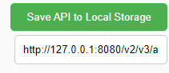
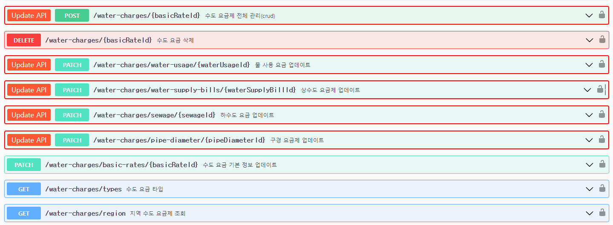
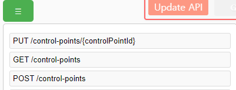

# Swagger extention
### 만든 이유
- 이 프로젝트는 프론트와 백엔드가 의사소통의 비용을 줄이기 위해서 제작되었습니다.
- api가 많아질 경우 swagger에서 어떤 api가 업데이트되었는지 새로생겼는지 파악하기가 힘들기 때문에
이 확장 프로그램을 통해 좀 더 쉽게 찾을 수 있게 됩니다.
- 또한 바뀐 api는 어떻게 바꼈는지 확인할 수 있어(기능 구현 예정) api 변경 추적에 유용할것이다.

### 사용방법

1. 우측상단에 input box에 json형식으로 api내용들을 가져오는 url을 넣는다.
2. `save api to local storage` 버튼을 통해 api 내용들을 저장한다.

1. 변경되거나 새로 생긴 api는 빨간 테두리로 변경되고 update api 버튼이 생긴다.
2. update Api버튼을 누르면 변경된 사항이 저장되어 다음 호출부턴 변경, 생성 내용에서 제외된다.

1. 좌측 상단에 버튼을 누르면 변경되거나 생성된 api리스트가 조회된다.
2. api를 누르게되면 해당 api로 이동하게 된다.